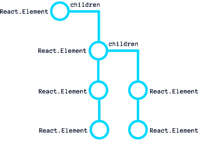

# Post-mount with `componentDidMount()`
 The last step in the Birth/Mount life cycle phase is our post-mount access via `componentDidMount()`. This method is called once all our children Elements and our Component instances are mounted onto the Native UI. When this method is called we now have access to the Native UI (DOM, UIView, etc.), access to our children `refs` and the ability to *potentially* trigger a new render pass.
 
## Understanding call order
 Similar to `componentWillMount()`, `componentDidMount()` is only called one time. Unlike our other Birth/Mount methods, where we start at the top and work down, `componentDidMount()` works from the bottom up. Let's consider the following Component/Element Tree again:
 
 

 When we begin the Birth phase, we process initialize through `render()` in this order: 
 
 ```
 A -> A.0 -> A.0.0 -> A.0.1 -> A.1 -> A.2.
 ```
 
 With `componentDidMount()` we start at the end and work our way back.
 
 ```
 A.2 -> A.1 -> A.0.1 -> A.0.0 -> A.0 -> A
 ```
 
 By walking backwards, we know that every child has mounted and also run its own `componentDidMount()`. This guarantees the parent can access the Native UI elements for itself and its children.
  
 Let's consider the following three components and their call order.

**GrandChild.js**
```javascript
/** 
 * GrandChild
 * It logs the componentDidMount() and has a public method called value.
 */ 
import React from 'react';
import ReactDOM from 'react-dom';

export default class GrandChild extends React.Component {

  componentDidMount() {
    console.log('GrandChild did mount.');
  }

  value() {
    return ReactDOM.findDOMNode(this.refs.input).value;
  }

  render() {
    return (
      <div>
        GrandChild
        <input ref="input" type="text" defaultValue="foo" />
      </div>
    );
  }
}
```

**Child.js**
```javascript
/*
 * Child
 * It logs the componentDidMount() and has a public method called value,
 * which returns the GrandChild value.
 */
import React from 'react';
import GrandChild from './GrandChild';

export default class Child extends React.Component {

  componentDidMount() {
    console.log('Child did mount.');
  }

  value() {
    return this.refs.grandChild.value();
  }

  render() {
    return (
      <div>
        Child
        <GrandChild ref="grandChild" />
      </div>
    );
  }
}
```

**Parent.js**
```javascript
/*
 * Parent
 * It logs the componentDidMount() and then logs the child value()
 * method.
 */
import React from 'react';
import Child from './Child';

export default class Parent extends React.Component {

  componentDidMount() {
    console.log('Parent did mount.');
    console.log('Child value:', this.refs.child.value());
  }

  render() {
    return (
      <div>
        Parent
        <Child ref="child" />
      </div>
    );
  }
}
```

When we mount `<Parent />` in our application we get the following in the browser console:

```console
GrandChild did mount.
Child did mount.
Parent did mount.
Child value: foo
```

As you can see, the GrandChild's `componentDidMount()` was called first, followed by Child and then Parent. Because we are now mounted on the DOM and our children are created, the Parent can access it's `refs` and the GrandChild can access it's own DOM nodes. 

## Useful Tasks
 The `componentDidMount()` method can be a helpful heavy lifter for our Components. One of the most common tasks is interacting with the Native UI. Unlike `componentWillMount()` or `render()` we can now fully interact with the Native stack.
 
 For example, we may need to make changes to our current state based on how the Native UI laid out our content. We may need to figure out the current width/height of our children or our own instance. This is especially helpful in the browser where CSS layout drives a lot of our DOM calculations.
 
 Another useful task is setting up 3rd party UIs. For example, if we wanted to use a library like [C3.js](http://c3js.org/) or the [Date Range Picker](http://www.daterangepicker.com/), this is where we would initialize our UI libraries.
 
 **Chart.js**
 
```javascript
import React from 'react';
import ReactDOM from 'react-dom';
import c3 from 'c3';

export default class Chart extends React.Component {

  componentDidMount() {
    this.chart = c3.generate({
      bindto: ReactDOM.findDOMNode(this.refs.chart),
      data: {
        columns: [
          ['data1', 30, 200, 100, 400, 150, 250],
          ['data2', 50, 20, 10, 40, 15, 25]
        ]
      }
    });
  }

  render() {
    return (
      <div ref="chart"></div>
    );
  }
}
```

 In the above example, we leverage `componentDidMount()` to generate our chart, bind it to the DOM using `refs` and then pass in data.

 When integrating 3rd party libraries, we often need to bind to events, such as the user interacting with the Chart. This is where we would set up our listeners post-library initialization. We can also add more global listeners here, if we did not want to setup the listeners in the `componentWillMount()` call.

## Starting another render pass [^1]
 There are some unique situations where we may have a second render immediately after Birth/Mount. This is not a common situation and generally occurs when we have to change our current state based on the Native UI Layout. This could be calculating dynamic row height or column widths in a data table. It could be having to re-position the component's children based on how they are sized the first time.
 
 If you require this kind of functionality, you have the ability to call `this.setState()` or `forceUpdate()` in your `componentDidMount()`. If you change state or force an update (more on this feature later), your Component will begin another render pass and enter the [Growth/Update Phase](../growth_update_indepth.md). Because `componentDidMount()` is called only once, we don't have to worry about this method causing an infinite loop. But, this process can lead to issues down the road if you do not take the time to walk through all the potential ramifications of multiple renders.
 
***Up Next:*** [Growth/Update Phase In-Depth](../growth_update_indepth.md)

---
 
 [^1] Multiple render passes opens the door for serious performance issues. Proceed with extreme caution!

