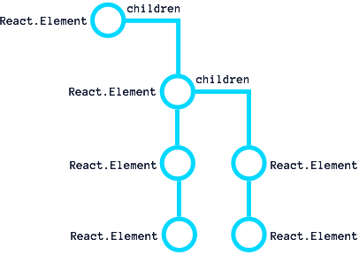

# Birth/Mounting In-depth
 A React component kicks off the life cycle during the initial application ex: `ReactDOM.render()`. With the initialization of the component instance, we start moving through the birth phase of the life cycle. Before we dig deeper into the mechanics of the birth phase, let's step back a bit and talk about what this phase focuses on.
 
 The most obvious focus of the birth phase is the initial configuration for our component instance. This is were we pass in the props that will define the instance. But during this phase there are a lot more moving pieces that we can take advantage of. 
 
 In this phase we configure the default state and get access to the initial display. It also starts the mounting process for children of the component. Once the children mount, we get first access to the Native UI layer[^1] (DOM, UIView, etc.). With Native UI access, we can start to query and modify how our content is actually displayed. This is also when we can begin the process of integrating 3rd Party UI libraries and components.
 
## Components vs. Elements
 When learning React, many developers have a common misconception. At first glance, one would assume that a mounted instance is the same as a component class. For example, if I create a new React component and then `render()` it to the DOM:
 
 ```javascript
 import React from 'react';
 import ReactDOM from 'react-dom';
 
 class MyComponent extends React.Component {
   render() {
     return <div>Hello World!</div>;
   }
 };
 
 ReactDOM.render(<MyComponent />, document.getElementById('mount-point')); 
 ```
 
 The initial assumption is that during `render()` an instance of the `MyComponent` class is created, using something like `new MyComponent()`. This instance is then passed to render. Although this sounds reasonable, the reality of the process is a little more involved.
 
 What is actually occurring is the JSX processor converts the `ReactDOM.render()` line to use `React.createElement` to generate the instance. This generated Element is what is passed to the `render()` method:
 
 ```javascript
 // generated code post-JSX processing
 ReactDOM.render(
   React.createElement(MyComponent, null), document.getElementById('mount-point')
 );
 ```
 
 A React Element is really just a description[^2] of what will eventually be used to generate  the Native UI. This is a core, pardon the pun, *element* of virtual DOM technology in React.
 
 
> The primary type in React is the ReactElement. It has four properties: type, props, key and ref. It has no methods and nothing on the prototype.
>
> -- https://facebook.github.io/react/docs/glossary.html#react-elements


The Element is a lightweight object representation of what will become the component instance. If we try to access the Element thinking it is the Class we will have some issues, such as availability of expected methods. 

So, how does this tie into the life cycle? These descriptor Elements are essential to the creation of the Native UI and are the catalyst to the life cycle.
 
## The First `render()`
 To most React developers, the `render()` method is the most familiar. We write our JSX and layout here. It's where we spend a lot of time and drives the layout of the application. When we talk about the first `render()` this is a special version of the `render()` method that mounts our entire application on the Native UI.

 In the browser, this is the `ReactDOM.render()` method. Here we pass in the root Element and tell React where to mount our content. With this call, React begins processing the passed Element(s) and generating instances of our React components. The Element is used to generate the type instance and then the props is passed to the component instance.

 This is the point where we entire the component life cycle. React uses the `instance` property on the Element and begins construction.

## Pre-mounting with `componentWillMount()`
 Now that the props and state are set, we finally enter the realm of Life Cycle methods. The first true Life Cycle called is `componentWillMount()`. This method is only called one time, which is before the initial render. Since this method is called before `render()` our Component will not have access to the Native UI (DOM, etc.). We also will not have access to the children `refs`, because they are not created yet.

The `componentWillMount()` is a chance for use to handle configuration, update our state, and in general prepare for the first render. At this point, props and initial state are define. We can safely query `this.props` and `this.state`, knowing with certainty they are the current values. This means we can start performing calculations or processes based on the prop values.

```javascript
import React from 'react';
import classNames from 'classnames';

class Person extends React.Component {
  constructor(props) {
    super(props);
    this.state = { mode: undefined } ;
  }

  componentWillMount() {
    let mode;
    if (this.props.age > 70) {
      mode = 'old';
    } else if (this.props.age < 18) {
      mode = 'young';
    } else {
      mode = 'middle';
    }
    this.setState({ mode });
  }

  render() {
    return (
      <div className={ classNames('person', this.state.mode) }>
        { this.props.name } (age: { this.props.age })
      </div>
    );
  }
}

Person.defaultProps = { age: 'unknown' };

export default Person;
```

In the example above, you can see that we can call `this.setState()` and update our current state before render. If we need state values on calculations passed in `props`, this is where we should do the logic. 

Other uses for `componentWillMount()` includes registering to global events, such as a Flux store. If you Component needs to respond to global Native UI events, such as `window` re-sizing or focus changes, this is a good place to do it[^3].

## Component `render()`
Now that we have pre-configured our component, we enter the first rendering of our content. As React developers, the `render()` method is the most familiar. We create Elements (generally via JSX) and return them. We access the Component `this.props` and `this.state` and let these values derive how content should be generated. When we access `this.state`, any changes we made during `componentWillMount()` are fully applied. 

Unlike any other method in the Life Cycle, `render()` is the one method that exists across multiple life cycle phases. It occurs here in Birth and it is where we spend a lot of time in Growth. 

In both cases, we have the core principal of keeping `render()` a pure method. What does that mean? That means we shouldn't call `setState()`, query the Native UI or anything else that can mutate the existing state of the application. The reason why is if we do this kind of interaction in `render()`, then it will kickoff another render pass. Which once again, triggers `render()` which then does the same thing... infinitely.

The React development tools are generally great at catching these kinds of errors and will yell at you if you do them. For example, if we did something silly like this

```javascript
render() {
  // BAD: Do not do this!
  this.setState({ foo: 'bar' });
  return (
    <div className={ classNames('person', this.state.mode) }>
      { this.props.name } (age: { this.props.age })
    </div>
  );
}
```

React would log out the following statement:

> Warning: setState(...): Cannot update during an existing state transition (such as within `render`). Render methods should be a pure function of props and state.

#### Native UI access in render is often fatal
React will also warn you if you try to access the Native UI elements in the render pass.

```javascript
render() {
  // BAD: Don't do this either!
  let node = ReactDOM.findDOMNode(this);
  return (
    <div className={ classNames('person', this.state.mode) }>
      { this.props.name } (age: { this.props.age })
    </div>
  );
}
```

> VM943:45 Warning: Person is accessing getDOMNode or findDOMNode inside its render(). render() should be a pure function of props and state. It should never access something that requires stale data from the previous render, such as refs. Move this logic to componentDidMount and componentDidUpdate instead.

In the above example, it may seem safe since you are just querying the node. But, as the warning states, we might be querying potentially old data. But in our case, during the Birth phase, this would be a fatal error.

> Uncaught Invariant Violation: findComponentRoot(..., .0): Unable to find element. This probably means the DOM was unexpectedly mutated (e.g., by the browser), usually due to forgetting a <tbody> when using tables, nesting tags like <form>, <p>, or <a>, or using non-SVG elements in an <svg> parent. Try inspecting the child nodes of the element with React ID ``.

This is one of those cases where the React error doesn't clearly point to the cause of the problem. In our case we didn't modify the DOM, so it feels like an unclear and potentially misleading error. This kind of error can cause React developers a lot of pain early on. Because we instinctually look for a place where we are changing the Native UI.

The reason we get this error is because during the first render pass, the Native UI doesn't exist yet. We are essentially asking React to find a DOM node that doesn't exist. Generally, when `ReactDOM` can't find the node, this is because something or someone mutated the DOM. So, React falls back to the most common cause. 

As you can see, having an understanding of the Life Cycle can help troubleshoot and prevent these often un-intuitive issues.

## Managing Children Components and Mounting
Now that we have completed the first render pass, our `render()` method returns a React Element. This Element may have many children elements. Those children, may also have children. etc. etc.



With the potential for an *n* depth tree of Elements, each of the instances need to go through their own entire life cycle process. Each child Element defined in the return `render()` will be constructed, 


## Post-mount with `componentDidMount()`

 
 ***Next Up:*** [Growth/Update In-depth](growth_update_indepth.md)

---

[^1] The Native UI layer is actual system that handles UI rendering to screen. In a browser, this is the DOM. On device, this would be the UIView. React handles the translation of content to the native layer format, but offloads the actual visual rendering to the platform being used.

[^2] Dan Abramov chimed in with this terminology on a StackOverflow question. http://stackoverflow.com/a/31069757