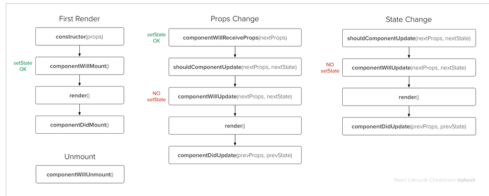

# The Life Cycle Recap
We have now worked through the three phases of the React life cycle: [Birth/Mounting](birth_mounting_indepth.md), [Growth/Update](growth_update_indepth.md) and finally [Death/Unmount](death_unmounting_indepth.md). By having these phases and corresponding methods React provides us a clear path for developing Components. These phases also allow us to begin to optimize our Components and our entire application.

To review, the methods and order called are:

## Birth / Mounting
1. Initialize / Construction
2. `getDefaultProps()` *(React.createClass)* or `MyComponent.defaultProps` *(ES6 class)*
3. `getInitialState()` *(React.createClass)* or `this.state = ...` *(ES6 constructor)*
4. `componentWillMount()`
5. `render()`
6. Children initialization & life cycle kickoff
7. `componentDidMount()`
  
## Growth / Update
1. `componentWillReceiveProps()`
2. `shouldComponentUpdate()`
3. `render()`
4. Children Life cycle methods
5. `componentWillUpdate()`

## Death / Un-Mounting
1. `componentWillUnmount()`
4. Children Life cycle methods
5. Instance destroyed for Garbage Collection

## Life Cycle Flowchart and `setState()` safety

In addition, this flow chart by [Peter Beshai](https://twitter.com/pbesh) breaks down the different methods and also calls out when `this.setState()` is safe and NOT safe to call:

