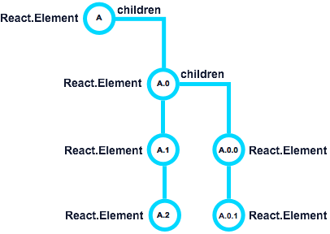

# Post-Render with `componentDidUpdate()`
 Continuing the trend of corresponding methods, the `componentDidUpdate()` is the Update version of [`componentDidMount()`](../birth/post_mount_with_component_did_mount.md). Once again, we can access the Native UI stack, interact with our `refs` and if required start another re-render/update [^1].
 
 When `componentDidUpdate()` is called, two arguments are passed: `prevProps` and `prevState`. This is the inverse of `componentWillUpdate()`. The passed values are what the values where and accessing `this.props` and `this.state` are the current values.
 
 
 
 Just like `componentDidMount()`, the `componentDidUpdate()` is called after all of the children are updated. Just to refresh your memory, **A.2** will have `componentDidUpdate()` called first, then **A.1**, **A.0.1**, **A.0.0**, etc. Walking all the way back up the tree until it finally reaches **A**.
 
## Common Tasks
 The most common uses of `componentDidUpdate()` is managing 3rd party UI elements and interacting with the Native UI. When using 3rd Party libraries, like our Chart example, we need to update the UI library with new data.
 
```javascript
componentDidUpdate(prevProps, prevState) {
  // only update chart of the data has changed
  if (prevProps.data !== this.props.data) {
    this.chart = c3.load({
      data: this.props.data
    });
  }
}
```
 
 ---
 
 [^1] This is a risky behavior and can easily enter an infinite loop. Proceed with caution.
