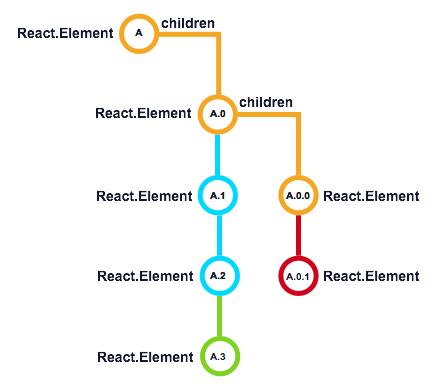

# Re-rendering and Children Updates
 Once again we return to `render()`. Now that our `props` and `state` are all updated[^1] we can apply them to our content and children. Just like the initial render,[ all the same rules and conditions apply](../birth/component_render.md). 
  
 Unlike our first render, React performs different management when it comes to the generated Elements. The main difference is around the initialization phase and children Elements of the Component. 
 
 
 
 React compares the current Element tree structure returned from the `render()` method. React uses the generated keys (or assigned keys) to match each Element to a Component instance. React determines if we have new instances (**A.3**), removing instances (**A.0.1**) or are updating existing instances (**A**, **A.0**, **A.0.0**).
 
 If the keys are the same, then React will pass the `props` to the existing instance, kicking off its Update life cycle. If we have added new components or changed keys, React will create new instances from the Element data. These new Components then entire the Birth/Mounting phase.
 
 ***Up Next:*** [Post-Render with `componentDidUpdate()`](postrender_with_componentdidupdate.md)
 
 ---
 
 [^1] As mentioned earlier, the asynchronicity nature of state is now fully applied and can be accessed safely.
 
 