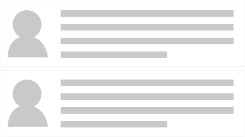

# Component Evolution and Composition
 Component reuse and composability are some of the core tenants of React development. As our applications scale, development time can be dramatically reduced through this process. Yet, creating reusable Components takes planning and understanding to support every use case.
 
 Understanding the intention of the Component is the first step towards reuse. Sometimes, we know a Component will be used in many different ways from the start. In those situations, we can plan for the different scenarios right away. In other situations, Component intentions will change over the lifespan of the application. Understanding how to evolve a Component is just as important as understanding how to create re-usability.
 
 ##The Application Architecture process
 
 Let's take a quick moment and discuss the process of application architecture. We often hear about over-architected systems. This often occurs when we try to plan for every possible scenario that could ever occur through the life of an application. To try and support every conceivable use is a fools errand. When we try to build these systems we add unnecessary complexity and often make development harder, rather then easier.
 
 At the same time, we don't want to build a system that offers no flexibility at all. It maybe faster to just build it without future thought, but adding new features can be just as time consuming later on. Trying to find the right balance is the hardest part of application architecture. We want to create a flexible application that allows growth but we don't waste time on possibilities.
 
 The other challenge with application architecture is trying to understand our needs. With development, we often have to build out something to truly understand it. This means that our application architecture is a living process. It changes over time due to having better understanding of what's required. Refactoring Components is critical to the success of a project and helps make adding new features easier.
 
 Because of this process, we felt it is important to walk through the evolution of a Component. 
We will start with a naive approach to building a List Component and then walk through different refactorings to support reusablity. More then likely, we would know early on that a List should be reusable. But, walking through the evolution process can help deepen our understanding of how to enable reusablity.
 
## The evolution of a List Component
 Lists are everywhere in applications today. The list is crucial to Social Media UIs, such as Facebook, Twitter, Reddit, Instagram, etc. The current demo app trend of Todos are all about displaying a list of items. The lowly drop-down displays a list of select-able options. It's so common, most of us take lists for granted.
 
 When we start building our application how should we approach creating reusable Components? Let's walk through a possible progression of a list feature.
 
### The first pass
 Typically, the first approach is to build a React component that renders the UI to the specific layout and data needs. For our example, we are building a list of customer profiles. The first design round requires the profile to have an avatar/picture and descriptive text.
 


The first step would be to create a Component that takes an Array of Objects, which has an image path and the description text. Our Component will loop over this Array and render out each element, using `<li>` items.

```javascript
import React from 'react';

class List extends React.Component {
  renderProfiles () {
    return this.props.profile.map( (profile) => {
      return (
        <li>
          
          <div className="profile-description">
            { profile.description }
          </div>
        </li>
      );
    });
  }

  render() {
    return (<ul className="profile-list">{ this.renderProfiles() }</ul>);
  }
}

List.defaultProps = { profile: [] };
export default List;
```

We would then apply styling to the `<ul>`, `<li>` and `<div>` elements to meet our design needs. This Component is a simple way of rendering out our content. It does meet are design needs but isn't reusable.

### Requirements change
 As with any project, needs change. For our example, the users now want to list more details about each customer. The design team comes up with a new layout and we now have to support optional fields.
 
 
 
 With this new design we now need to do our first bit of Component refactoring. To support the new optional detail fields we need to add logic to our Profile rendering. A good development practice is to keep our React Components as compartmentalized as possible. This enables multiple benefits.
 
 The first is reducing cognitive load. Having smaller, single focused Components means they are easier to read and understand their intention. A common experience we have all had as developers is returning to our own code six or more months later. Because we wrote it, we *should* understand it, but often it takes a bit of time to put ourselves back into mindset of what the code is solving. If the Component has hundreds of lines of logic, it will take that much more time to grok what the intention is. Event harder is doing this with another developers work.
 
 One of the beautiful features of React is that we can (and should) break our Components into small bite-sized chunks. Because it is so easy in React, this helps us make our code easier to understand. At the same time, this leads to the second benefit: faster reusability.
 
 If we break out a Component to a single task, such as rendering a single profile, we now have the potential to reuse it. It is possible that elsewhere in the app we need to show a profile. With our current implementation, this is not easily done. This is because the rendering of the profile details is handled by the List component. Let's break the profile details out into a new Component and refactor our List a bit.
 
### Creating a Profile Component
 The first step is to move the render code from the List into it's own Component.
 
 **Profile.js**
```javascript
import React from 'react';

export default class Profile extends React.Component {
  renderDetails(key, label){
    if (this.props[key]) {
      return (<div className="detail">{ label } { this.props[key] }</div>);
    }
  }

  render() {
    return (
      <li>
        
        <div className="profile-description">
          { this.props.description }
        </div>
        { this.renderDetails('email', 'Email:') }
        { this.renderDetails('twitter', 'Twitter:') }
        { this.renderDetails('phone', 'Phone:') }
      </li>
    );
  }
}
```

 Here we have broken out the optional details rendering into a new Component called `Profile`[^1]. We can then update our List code:

 **List.js**

```javascript
import React from 'react';
import Profile from './Profile';

class List extends React.Component {
  render() {
    return (
      <ul>
        { this.props.profile.map( (profile) => <Profile {...profile} /> ) }
      </ul>
    );
  }
}

List.defaultProps = { profile: [] };
export default List;
```

 Now our List maps the profile data and sends it to the `Profile` Component for rendering. By isolating the rendering of the profile to a single component we have a clear [separation of concerns (SoC)](https://en.wikipedia.org/wiki/Separation_of_concerns). Not only do we get the benefit of SoC we also make each Component a lot easier to understand. When we have to return to this code six months later, it will be a lot faster to get caught back up.
 
## Rendering different content
 By moving our UI rendering of each Profile to a Component, we have separated layout and content display. The List is responsible for layout and data management. The Profile is responsible for UI rendering for each individual item. Because of this first step, we can move it one step further and make our List even more flexible.
 
### List Feature expansion
 Continuing our customer example, let's image that our Profile List has started to evolve even more. We have added pagination support, selection management, sorting, filtering, etc. Now, our users request that we enable the ability to manage a different kind of content. They now want to manage Posts. 
 
 These Posts have some similar UI elements as our profile: images, descriptions, and details. But the layout and content vary drastically. We still need all the of the functionality of the list, pagination, filtering, etc. The question becomes, how do we handle this?
 
### Item Rendering
 A simple approach would be to add a switch in our List's `map` method. The switch checks the data type and then choose to use the Profile Component or the Post Component. But, this approach adds a pretty bad [code smell](https://en.wikipedia.org/wiki/Code_smell). Similar to our first draft of the List, it meets our immediate needs but what happens when we need a Message List? Soon our List has a lot of switches.
 
 A better way to solve this is through configuration. We can expose a prop on the List component that handles rendering each item. There are two ways to do this: by passing in a function or by passing in a Component Class.
 
#### Function Item Renderer
 The first approach we will examine is passing in a function that handles rendering out each individual item in the List. The first step is to update our List component to require a `itemRenderer` prop that is a function and changing our profiles `prop` to items.
 
**List.js**
```javascript
import React from 'react';

class List extends React.Component {
  render() {
    return (
      <ul>
        { this.props.items.map( (item, index) => this.props.itemRenderer(item, index) ) }
      </ul>
    );
  }
}

List.propTypes = {
  items: React.PropTypes.array,
  itemRenderer: React.PropTypes.func.isRequired 
};
List.defaultProps = { items: [] };
export default List;
```

We have added a `propTypes` configuration to require the `itemRenderer` prop which needs to be a function. We also added an items `prop`, which replaces `profiles`. In our `render()` we now call the function passing in the item instance data and the index. We will talk more about why we need to pass `index` in a bit. In our parent Component or App we now do the following:

**index.js**
```javascript
import React from 'react';
import ReactDOM from 'react-dom';
import List from './components/List';
import Profile from './components/Profile';
import Posts from './components/Posts';

let profileData = [ ... ] // psuedo code, this has all our profile data
let postsData = [ ... ] // psuedo code, this has all our post data

class App extends React.Component {
  renderProfile(profile, key) {
    return (<Profile {...profile} key={ key } />);
  }
  
  renderPosts(posts, key) {
    return (<Posts {...post} key={ key } />);
  }
  
  render() {
    return (
      <div>
        <List items={ profileData } itemRenderer={ this.renderProfile } />
        <List items={ postsData } itemRenderer={ this.renderPosts } />
      </div>
    );
  }
}

ReactDOM.render(<App />, document.getElementById('mount-point'));
```

In `index.js` we render out two different List components. For the first, we pass in our profile data and our `renderProfile` method reference. Just like any React action (such as `onClick`) we pass the method reference and do not actually call the method. For the second, we pass in the posts data and the `renderPosts` method reference.

When the Lists render, the `map` method calls either `renderProfile()` or `renderPosts()` with each data element and the current index. 

#### React keys and arrays of components
 The reason we pass index is that we need to generate a unique key for each item in the list. When we offload rendering to a method, we no longer get React's built in ability to generate the keys for us.

 React Component keys are used for Component Reconciliation. 
 
> Reconciliation is the process by which React updates the DOM with each new render pass...
> 
> ... The situation gets more complicated when the children are shuffled around (as in search results) or if new components are added onto the front of the list (as in streams). In these cases where the identity and state of each child must be maintained across render passes, you can uniquely identify each child by assigning it a key
>
> When React reconciles the keyed children, it will ensure that any child with key will be reordered (instead of clobbered) or destroyed (instead of reused).
> 
> -- [React Child Reconciliation](https://facebook.github.io/react/docs/multiple-components.html#child-reconciliation) 

If we don't set a key when generating children dynamically (via our itemRenderer method) we would get the following warning:

> Warning: Each child in an array or iterator should have a unique "key" prop. Check the render method of `List`. See https://fb.me/react-warning-keys for more information.

The quick solution is to pass in the index of the data, but this may not the ideal solution. This generates a key based on item order. It may be better to use an unique `id` that's defined on the data set. Another option is generating a hash code or some other unique identifier that reflects the data element.

By having a identifier based on the data instead of order, we can help optimization of the Component rendering. This can occur when we display partial lists, such as filtering or changing list order, such as sorting. If our key is based on the data and not order, then React knows it doesn't have to generate a new instance for the data element. It just needs to reorder the elements.

#### Component Item Renderer
 Another option for handling dynamic renderers, is to use a Component Class reference. This process is similar to passing in a function. Instead of offloading the rendering to the return value of a method we create a React Element and pass in the configuration.
 
 **List.js**
```javascript
import React from 'react';
import Profile from './Profile';

class List extends React.Component {
  render() {
    return (
      <ul>
        { this.props.profile.map( (profile, index) => {
            let newProps = Object.assign({ key: index }, profile);
            return React.createElement(this.props.itemRenderer, newProps);
        }) }
      </ul>
    );
  }
}

List.propTypes = { itemRenderer: React.PropTypes.func };
List.defaultProps = { profile: [], itemRenderer: Profile };
export default List; 
```
 
 In this new version of the List Component, we create a new React Element using the `this.props.itemRenderer` as the Component Class type. We generate a `newProps` object that adds the `key` to the profile data and pass this to the Element as its `props`.
 
 Because we define a default item renderer of `Profile` in the `defaultProps` we can update `propTypes` to make `itemRenderer` an optional param. To use this version of the List our index.js now looks like this:
 
**index.js**
 ```javascript
import React from 'react';
import ReactDOM from 'react-dom';
import List from './components/List';
import Profile from './components/Profile';
import Post from './components/Post';

let profileData = [ ... ] // psuedo code, this has all our profile data
let postsData = [ ... ] // psuedo code, this has all our post data

class App extends React.Component { 
  render() {
    return (
      <div>
        <List items={ profileData } />
        <List items={ postsData } itemRenderer={ Post } />
      </div>
    );
  }
}

ReactDOM.render(<App />, document.getElementById('mount-point'));
```

Since we have a default item renderer (the Profile Component), the first version of the List just needs the profile data. The second version, we change out the renderer type by passing in our Component and pass in the item data.

When our List renders the data it now creates a React Element from the the `itemRenderer` value and passes in the current data element. At DevelopmentArc, we have found using a React Class is a much cleaner approach to developing replaceable UI elements.

## Higher Order Components
 The last Component composition pattern we will examine in this section is *Higher Order Components* (HOC). As [Dan Ambrov discusses](https://medium.com/@dan_abramov/mixins-are-dead-long-live-higher-order-components-94a0d2f9e750#.b74nxbqew), Higher Order Components where first proposed by [Sebastian Markbåge](https://gist.github.com/sebmarkbage/ef0bf1f338a7182b6775) in a gist. The core idea of HOC is to define a function, which you pass one or more Components to. This function generates and returns a new Component which is a wrapper around the passed in Component(s).
 
 The need for HOC came about with React's move to support ES6 classes and the lack of mixin support with the new JavaScript Class syntax. To handle this change, a new pattern needed to be defined to replace mixins. Typically, mixins add/override functionality around the [Component Life Cycle](../life_cycle/introduction.md) and enable sharing reusable code in a elegant way. Without mixin support in ES6, the HOC pattern was created.
 
 ### A form group example
  For our HOC example, we will create a function for wrapping a Component in a custom form group with an optional `<label>` field. The goal of the HOC is to allow us to create two outputs, with and without a label:
  
  ```html
  <!-- With a label -->
  <div class="form-group">
    <label class="form-label" for="firstName">First Name:</label>
    <input type="text" name="firstName" />
  </div>
  
  <!-- Without a label -->
  <div class="form-group">
    <input type="text" name="lastName" />
  </div>
  ```
 
 Because this could become a common task, we can use the HOC pattern to generate our form group wrapper and let it decide if it should inject the label or not.
 
 **formGroup.js**
```javascript
import React from 'react';
import { isString } from 'lodash';

function formGroupBuilder(Component, config) {
  const FormGroup = React.createClass({
    __renderLabel() {
      // check if the passed value is a string using Lodash#isString
      if (isString(this.props.label)) {
        return(
          <label className="form-label" htmlFor={ this.props.name }>
            { this.props.label }
          </label>
        );
      }
    },

    __renderElement() {
      // We need to see if we passed a Component or an Element
      // such as Profile vs. <input type="text" />
      if (React.isValidElement(Component)) return React.cloneElement(Component, config);
      return React.createElement(Component, config);
    },

    render() {
      return(
        <div className="form-group">
          { this.__renderLabel() }
          { this.__renderElement() }
        </div>
      );
    }
  });

  return(<FormGroup { ...config } />);
}

export default formGroupBuilder;
```

Let's examine the above code. The first thing we do is create a function called `formGroupBuilder` which takes two arguments: `Component` and `config`.

```javascript
function formGroupBuilder(Component, config) {
  ...
}

export default formGroupBuilder;
```

The Component will be the instance we want to wrap in our form group. In function, we create a new React Component and then generate/return an Element instance of the component using the config as props.

```javascript
const FormGroup = React.createClass({
  ...
});

return(<FormGroup { ...config } />);
```

---

[^1] Following this pattern we could go even further if so desired. We could break out each Profile detail into its own Component. Yet, that maybe going too far down the granularity rabbit hole. Once again, over-architecture is a slippery slope and having to make a judgment call is part of the process.
 
 