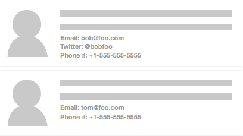

# Component Composition and Evolution
 Component reuse and composability are some of the core tenants of React development. As our applications scale, development time can be dramatically reduced through this process. Yet, creating reusable Components takes planning and understanding to support every use case.
 
 Understanding the intention of the Component is the first step towards reuse. Sometimes, we know a Component will be used in many different ways from the start. In those situations, we can plan for the different scenarios right away. In other situations, Component intentions will change over the lifespan of the application. Understanding how to evolve a Component is just as important as understanding how to create reusability.
 
 ##The Application Architecture process
 
 Let's take a quick moment and discuss the process of application architecture. We often hear about over-architected systems. This occurs when we try to plan for every possible scenario that could ever occur through the life of an application. To try and support every conceivable use is a fools errand. When we try to build these systems we add unnecessary complexity and often make development harder, rather then easier.
 
 At the same time, we don't want to build a system that offers no flexibility at all. It maybe faster to just build it without thought, but adding new features can be just as time consuming later on. Trying to find the right balance is the hardest part of system architecture. We want to create a flexible application that allows growth but we don't waste time on possiblities.
 
 The other challenge with architecture is trying to understand our needs. With development, we often have to build out something to truly understand it. This means that our system architecture is a living process. It changes over time due to having better understanding of what is required. Refactoring Components is critical to the success of a project as it moves forward and helps make adding new features easier.
 
 Because of this process, we felt it is important to walk through the evolution of a Component. 
We will start with a naive approach to building a List Component and then walk through different refactorings to support reusablity. More then likely, we would know early on that a List should be reusable. But, walking through the evolution process can help deepen our understanding of how to enable reusablity.
 
## The evolution of a List Component
 Lists are everywhere in applications today. The list is crucial to Social Media UIs, such as Facebook, Twitter, Reddit, Instagram, etc. The current demo app trend of Todos are all about displaying a list of items. The lowly drop-down displays a list of select-able options. It's so common, most of us take lists for granted.
 
 So, when we start building our application how should we approach creating reusable Components? Let's walk through a possible progression of a list feature.
 
### The first pass
 Typically, the first approach is to build a React component that renders the UI to the specific layout and data needs. For our example, we are building a list of user profiles. The first design round requires the profile to have an avatar/picture and descriptive text.
 


The first step would be to create a Component that takes an Array of Objects, which has an image path and the description text. Our Component would then loop over this Array and render out each element, using `<li>` items.

```javascript
import React from 'react';

class List extends React.Component {
  renderProfiles () {
    return this.props.profile.map( (profile) => {
      return (
        <li>
          
          <div className="profile-description">
            { profile.description }
          </div>
        </li>
      );
    });
  }

  render() {
    return (<ul className="profile-list">{ this.renderProfiles() }</ul>);
  }
}

List.defaultProps = { profile: [] };
export default List;
```

We would then apply styling to the `<ul>`, `<li>` and `<div>` elements to meet our design needs. This Component is a simple way of rendering out our content. It meets are design needs but isn't reusable.

### Requirements change
 As with any project, needs change. For our example, our customers now want to list more details about each user. The design team comes up with a new layout and we now have to support optional fields.
 
 
 
 With this new design we now need to do our first bit of Component refactoring. To support the new optional detail fields we need to add logic to our Profile rendering. A good development practice is to keep our React Components as compartmentalized as possible. This enables a few different benefits.
 
 The first is reducing cognitive load. Having smaller, single focused Components means they are easier to read and understand their intentions. A common experience we have all had as developers is returning to our own code six or more months later. Because we wrote it, we *should* understand it, but often it takes a bit of time to put ourselves back into mindset of what the code is solving. If the Component has hundreds of lines of logic, it will take that much more time to grok what the intention is. Event harder is doing this with another developers code.
 
 One of the beautiful features of React is that we can (and should) break our Components into small bite-sized chunks. Because it is so easy in React, this helps us make our code easier to understand. At the same time, this leads to the second benefit: faster reusability.
 
 If we breakout a Component to a single task, such as rendering out a Profile, we now have the ability to easily reuse it. Maybe elsewhere in the app we need to show a single Profile. With our current implementation, this is not easily done because the rendering of the list item is done in the list itself. Let's break it out into a new Component and refactor our List a bit.
 
### Creating a Profile Component
 The first step is to move the render code from the List into it's own Component.
 
 **Profile.js**
```javascript
import React from 'react';

export default class Profile extends React.Component {

  renderDetails(key, label){
    if (this.props[key]) {
      return (<div className="detail">{ label } { this.props[key] }</div>);
    }
  }

  render() {
    return (
      <li>
        
        <div className="profile-description">
          { this.props.description }
        </div>
        { this.renderDetails('email', 'Email:') }
        { this.renderDetails('twitter', 'Twitter:') }
        { this.renderDetails('phone', 'Phone:') }
      </li>
    );
  }
}
```

 Here we have broken out the optional details rendering into a new Component called `Profile`. We can then update our List.

 **List.js**

```javascript
import React from 'react';
import Profile from './Profile';

class List extends React.Component {
  render() {
    return (
      <ul>
        { this.props.profile.map( (profile) => <Profile {...profile} /> ) }
      </ul>
    );
  }
}

List.defaultProps = { profile: [] };
export default List;
```

 Now our list simply maps the profile data and sends it to the `Profile` Component for rendering.
 
 Following this pattern we could go even further if so desired. We could break out each Profile detail into its own Component. Yet, that maybe going too far down the granularity rabbit hole. Once again, over-architecture is a slippery slope.