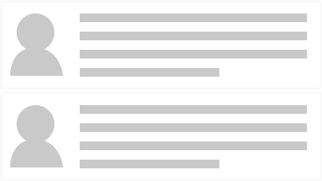
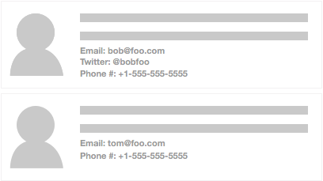

# The Evolution of a List Component
 Lists are everywhere in applications today. The list is crucial to Social Media UIs, such as Facebook, Twitter, Reddit, Instagram, etc. The current demo app trend of Todos are all about displaying a list of items. The lowly HTML drop-down displays a list of select-able options. It's so common, most of us take lists for granted.
 
 When we start building our application how should we approach creating reusable Components? Let's walk through a possible progression of a list feature.
 
## The first pass
 Typically, the first approach is to build a React component that renders the UI to the specific layout and data needs. For our example, we are building a list of customer profiles. The first design round requires the profile to have an avatar/picture and descriptive text.
 
** UI Wireframe #1**



The first step would be to create a Component that takes an Array of Objects, which has an image path and the description text. Our Component will loop over this Array and render out each element, using `<li>` items.

```javascript
import React from 'react';

class List extends React.Component {
  renderProfiles () {
    return this.props.profile.map( (profile) => {
      return (
        <li>
          
          <div className="profile-description">
            { profile.description }
          </div>
        </li>
      );
    });
  }

  render() {
    return (<ul className="profile-list">{ this.renderProfiles() }</ul>);
  }
}

List.defaultProps = { profile: [] };
export default List;
```

We would then apply styling to the `<ul>`, `<li>` and `<div>` elements to meet our design needs. This Component is a simple way of rendering out our content. It meets our design needs but isn't reusable.

## Requirements change
 As with any project, needs change. For our example, the users now want to list more details about each customer. The design team comes up with a new layout and we now have to support optional fields.
 
 ** UI Wireframe #2**
 
 
 
 With this new design we now need to do our first bit of Component refactoring. To support the new optional detail fields we need to add logic to our Profile rendering. A good development practice is to keep our React Components as compartmentalized as possible. This enables multiple benefits.
 
 First, it helps reduce cognitive load. Having smaller, single focused Components means they are easier to read and understand the intention. A common experience we have all had as developers is returning to our own code six or more months later. Because we wrote it, we *should* understand it, but often it takes a bit of time to put ourselves back into mindset of what the code is solving. If the Component has hundreds of lines of logic, it will take that much more time to grok what the intention is. Even harder (and time consuming) is doing this with another developers work.
 
 One of the beautiful features of React is that we can (and should) break our Components into small bite-sized chunks. Because it is so easy in React, this helps us make our code easier to understand. At the same time, this leads to the second benefit: faster reusability.
 
 If we break out a Component to a single task, such as rendering a single profile, we now have the potential to reuse it. It is possible that elsewhere in the app we need to show a profile. With our current implementation, this is not easily done. This is because the rendering of the profile details is handled internally by the List component. Let's break the profile details out into a new Component and refactor our List a bit.
 
## Creating a Profile Component
 The first step is to move the render code from the List into it's own Component.
 
 **Profile.js**
```javascript
import React from 'react';

export default class Profile extends React.Component {
  renderDetails(key, label){
    if (this.props[key]) {
      return (<div className="detail">{ label } { this.props[key] }</div>);
    }
  }

  render() {
    return (
      <li>
        
        <div className="profile-description">
          { this.props.description }
        </div>
        { this.renderDetails('email', 'Email:') }
        { this.renderDetails('twitter', 'Twitter:') }
        { this.renderDetails('phone', 'Phone:') }
      </li>
    );
  }
}
```

 Here we have broken out the optional details rendering into a new Component called `Profile`. Profile's job is to render out the base layout and then render out our optional details, depending of if they are defined or not[^1]. We can then update our List code:

 **List.js**

```javascript
import React from 'react';
import Profile from './Profile';

class List extends React.Component {
  render() {
    return (
      <ul>
        { this.props.profile.map( (profile) => <Profile {...profile} /> ) }
      </ul>
    );
  }
}

List.defaultProps = { profile: [] };
export default List;
```

 Now our List maps the profile data and sends it to the `Profile` Component for rendering. By isolating the rendering of the profile to a single component we have a clear [separation of concerns (SoC)](https://en.wikipedia.org/wiki/Separation_of_concerns). Not only do we get the benefit of SoC, we also make each Component a lot easier to understand. When we have to return to this code six months later, it will be a lot faster to get caught back up.
 
 ***Next Up***: [Rendering Different Content](rendering_different_content.md)

 
 ---
 
 [^1] Following this pattern we could go even further if so desired. We could break out each Profile detail into its own Component. Yet, that maybe going too far down the granularity rabbit hole. Once again, over-architecture is a slippery slope and having to make a judgment call is part of the process.

